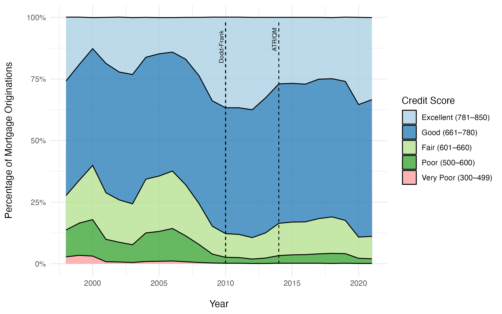

# Overview

This report analyzed over 20 years of U.S. residential mortgages (1998-2021) that were gathered from the National Mortgage Database (NMDB®). Most notable is the fact that the dominant number of borrowers has reversed from two borrowers to a single borrower per mortgage, and recent regulation has caused lenders to approve mortgages for applicants with a good or excellent credit score more than ever before. This report assesses how interest rates have affected mortgage demand over two decades; how regulations have affected borrower creditworthiness; demographic changes in age, gender, and number of mortgage signers; and finally what the typical borrower profile looks like in recent times.

# Directory Structure

This repository is organized as a reproducible research compendium. There are four main sources of information: 

1. The original dataset: "data/mortgages.csv.zip" (This is a large file, so download the zipped folder then extract the .csv file.)
2. NMDB technical notes about the dataset: "data/nmdb-data-dictionary-technical-notes.pdf"
3. The R Studio file the produced the report: "code/mortgage-analysis.Rmd"
4. PDF of the final report: "reports/mortgage-analysis.pdf"
