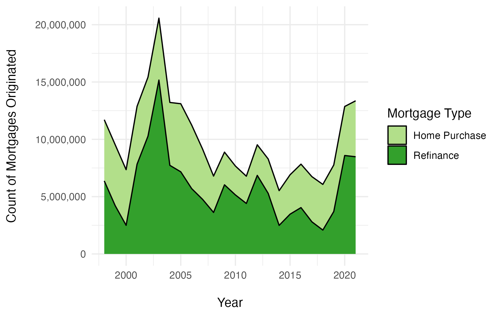

# Overview

This report analyzed over 20 years of U.S. residential mortgages (1998-2021) that were gathered from the
National Mortgage Database (NMDB®). Most notably is the fact that the dominant number of borrowers
has reversed from two borrowers to a single borrower per mortgage, and recent regulation has caused lenders
to approve mortgages for applicants with a good or excellent credit score than ever before. This report will
first assess how interest rates have affected mortgage demand over the two-decade time period; followed by
the effect of regulations on borrower creditworthiness; changes in the age of borrowers, gender, and amount
of borrowers per mortgage; then finally a conclusion of what a typical borrower profile looks like today.

# Directory Structure

This repository is organized as a reproducible research compendium. There are four main sources of information: 

1. The original dataset: "data/mortgages.csv.zip" (This is a large file, so download the zipped folder then extract the .csv file.)
2. NMDB technical notes about the dataset: "data/NMDB-New-Mortgage-Statistics-Data-Dictionary-Technical-Notes.pdf"
3. The R Studio file the produced the report: "code/mortgage-analysis.Rmd"
4. PDF of the final report: "reports/mortgage-analysis.pdf"
